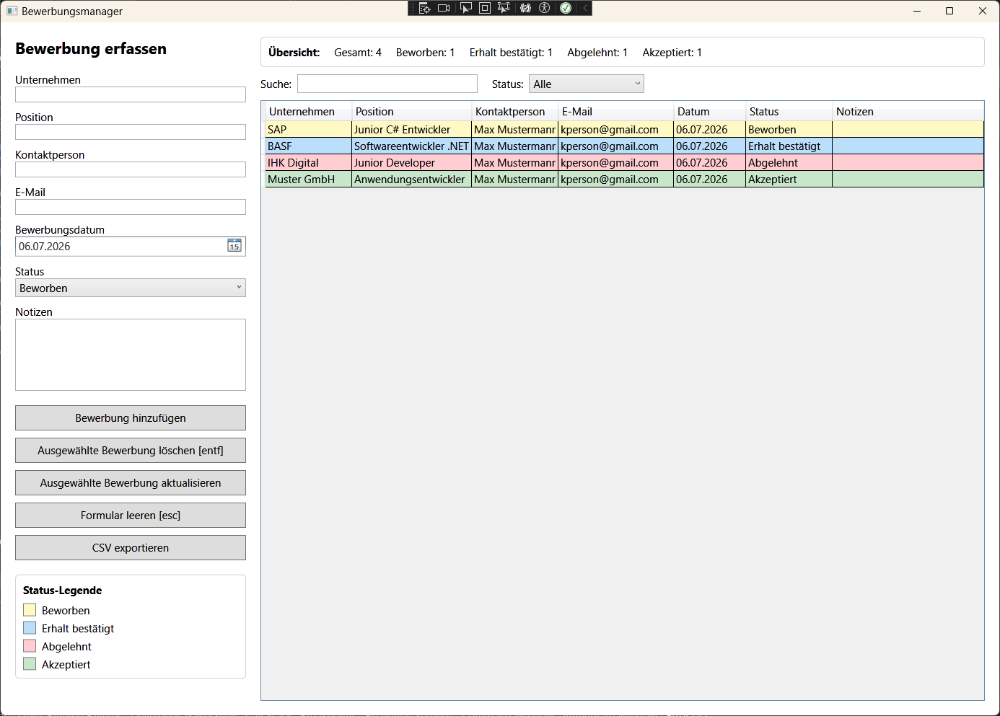

# Bewerbungsmanager

Eine kleine Desktop-App zur Verwaltung von Jobbewerbungen.

Die Anwendung ermöglicht es, Bewerbungen hinzuzufügen, lokal zu speichern, zu bearbeiten, zu löschen, zu durchsuchen, nach Status zu filtern und als CSV-Datei zu exportieren.  
Sie wurde als Portfolio-Projekt entwickelt, um C#, WPF, SQLite und Entity Framework Core praktisch anzuwenden.

## Screenshot

## Features

- Bewerbungen hinzufügen
- Bewerbungen lokal mit SQLite speichern
- SQLite-Datenbank im lokalen AppData-Ordner speichern
- Bewerbungen beim Start automatisch laden
- Ausgewählte Bewerbungen bearbeiten
- Ausgewählte Bewerbungen löschen
- Bewerbungen per Suchfeld durchsuchen
- Bewerbungen nach Status filtern
- Dashboard mit Anzahl der Bewerbungen pro Status anzeigen
- Aktuell angezeigte Bewerbungen als CSV exportieren
- Status farblich im DataGrid darstellen
- Status-Legende anzeigen
- Formular per Button oder Escape-Taste zurücksetzen
- Ausgewählte Bewerbung per Entf-Taste löschen
- Änderbares Bewerbungsdatum über DatePicker
- Deutsches Datumsformat
- Automatisch zentriertes Programmfenster
- Grundlegende Eingabevalidierung

## Technologien

- C#
- .NET 8
- WPF
- SQLite
- Entity Framework Core
- LINQ
- Git / GitHub

## Tastenkürzel

- `Esc` - Formular leeren und Auswahl aufheben
- `Entf` - Ausgewählte Bewerbung löschen

## Lokale Datenspeicherung

Die Anwendung speichert die SQLite-Datenbank im lokalen AppData-Verzeichnis des Benutzers.

Beispielpfad unter Windows:

`%localappdata%\Bewerbungsmanager\jobapplications.db`

Die Datenbankdatei wird nicht ins GitHub-Repository übernommen.

## Projektstruktur

    Bewerbungsmanager/
    ├── Data/
    │   └── ApplicationDbContext.cs
    ├── Models/
    │   └── JobApplication.cs
    ├── Services/
    │   └── JobApplicationService.cs
    ├── docs/
    │   └── screenshots/
    │       └── main-window.png
    ├── MainWindow.xaml
    ├── MainWindow.xaml.cs
    └── README.md

## Geplante Funktionen

- Verbesserte Detailansicht für Notizen
- Weitere Sortier- und Filteroptionen
- Weitere Code-Aufräumarbeiten nach MVVM-Prinzipien
- Optionaler Excel-Export

## Projektstatus

Version 0.5 - Bewerbungsmanagement mit lokaler SQLite-Datenbank, Bearbeiten/Löschen-Funktion, Suche, Statusfilter, CSV-Export, Dashboard, farblicher Statusanzeige und Tastenkürzeln.